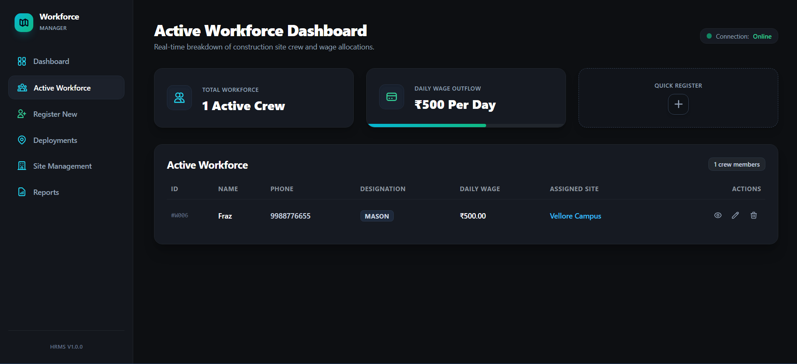

# Employee Management & Workforce HRMS Dashboard

[](https://www.oracle.com/java/)
[](https://spring.io/projects/spring-boot)
[](https://supabase.com/)
[](https://redis.io/)
[](https://react.dev/)
[](https://tailwindcss.com/)
[](https://swagger.io/)

A full-stack, enterprise-grade Employee Management and Workforce HRMS application designed for the construction industry to manage shift logs, tiered overtime payouts, and automated threshold alerts.

---

## 🚀 Project Overview

This application serves as a workforce monitoring platform mapping construction operations:
*   **Backend**: Developed with **Spring Boot 3.2.5** and **Spring Data JPA**. Operates transactional workflows for clock-in/out logging and overtime calculation.
*   **Database**: Hosted on **Supabase (PostgreSQL)**, utilizing PgBouncer pooling on port `6543` for connection stability under concurrent load.
*   **Caching**: Employs **Redis** to maintain real-time active worker sets with a lease-based 16-hour Time-to-Live (TTL) expiration safety net.
*   **Frontend**: Built with **React 18** and **Vite**, featuring a glassmorphic dashboard styled with **Tailwind CSS** that lists active crews and deployment metrics.
*   **API Documentation**: Exposes interactive testing capabilities via **Springdoc OpenAPI (Swagger UI)**.

---

## 🖥️ Dashboard Preview



👉 **[Local Dashboard Dev Link (Vite server)](http://localhost:5173)**

---

## 🏛️ Key Architectural Decisions

### 1. Interface Segregation for Cache Resilience
To prevent the application context from crashing on bootstrap when Redis is unavailable, the caching layer is segregated using Spring's conditional annotations:
*   **`CacheService` (Interface)**: Declares operations for caching, evicting, and listing active clocked-in workers.
*   **`RedisCacheService`**: Enabled via `@ConditionalOnProperty(name = "app.cache.provider", havingValue = "redis")`. Handles template hash keys and lease evictions when active.
*   **`NoOpCacheService` (Fallback)**: Configured with `matchIfMissing = true` to load automatically when Redis properties are absent. Bypasses cache writes and returns default empty sets to keep the system operational in local/dev environments.

### 2. Double-Layer Validation & Global Exception Handling
Data integrity is enforced at both the application and database layers:
*   **Bean Validation**: Entities utilize Jakarta validation constraints (`@NotBlank`, `@DecimalMin`, `@NotNull`) to validate incoming payloads before database persistence.
*   **Database Constraints**: Fields enforce `unique` phone number mappings and non-nullable records at the DDL schema layer.
*   **`GlobalExceptionHandler`**: A central `@RestControllerAdvice` translates business logic failures (like duplicate clock-ins, inactive site updates) and schema exceptions into structured JSON error envelopes:
    ```json
    {
      "error": "DUPLICATE_CLOCK_IN",
      "message": "Worker is already clocked in",
      "timestamp": "2026-06-05T08:00:00Z"
    }
    ```

### 3. Decoupled SMS Notifications & Event Listeners
Outbound notification services are decoupled from transactional database loops:
*   **Event Publishing**: Upon successful overtime settlement, the service publishes an `OvertimeSettlementEvent` instead of making synchronous SMS API calls inside database transactions.
*   **Transactional Observers**: The notification listener observes events utilizing `@TransactionalEventListener(phase = TransactionPhase.AFTER_COMMIT)`. This ensures SMS notifications only dispatch *after* database transactions commit successfully, eliminating partial-state messages if rollbacks occur.

### 4. Optimized API Communication & Axios Interceptors
The React client delegates server communications to a custom-configured Axios wrapper:
*   **Request Interceptors**: Automatically scans storage and appends authorization bearer tokens to outbound request headers.
*   **Response Interceptors**: Monitors responses globally. Catches `401 Unauthorized` and `403 Forbidden` status codes to wipe stale authentication states and redirect users without cluttering local component code.

---

## 🛠️ How to Run

### Prerequisites
*   Java 17 or higher
*   Node.js 18 or higher (with npm)
*   Supabase PostgreSQL credentials
*   Redis server (optional)

### 1. Run the Backend API

1.  Clone the repository and navigate to the project root.
2.  Configure database and Redis details in `src/main/resources/application.properties`.
3.  Build and run the Spring Boot application:
    ```bash
    # Windows
    mvnw.cmd spring-boot:run

    # Linux / macOS
    ./mvnw spring-boot:run
    ```
    The server will bootstrap and listen on `http://localhost:8080`.

### 2. Run the Frontend Dashboard

1.  Navigate to the `frontend/` directory:
    ```bash
    cd frontend
    ```
2.  Install dependencies:
    ```bash
    npm install
    ```
3.  Launch the Vite development server:
    ```bash
    npm run dev
    ```
    The dashboard will open on `http://localhost:5173`.

---

## 📖 Live API Documentation

The REST API exposes interactive testing endpoints. Once the backend is running, you can access the Swagger UI dashboard at:

👉 **[Swagger UI Documentation Dashboard](http://localhost:8080/swagger-ui/index.html)**

*   **OpenAPI specification URL**: `http://localhost:8080/v3/api-docs`